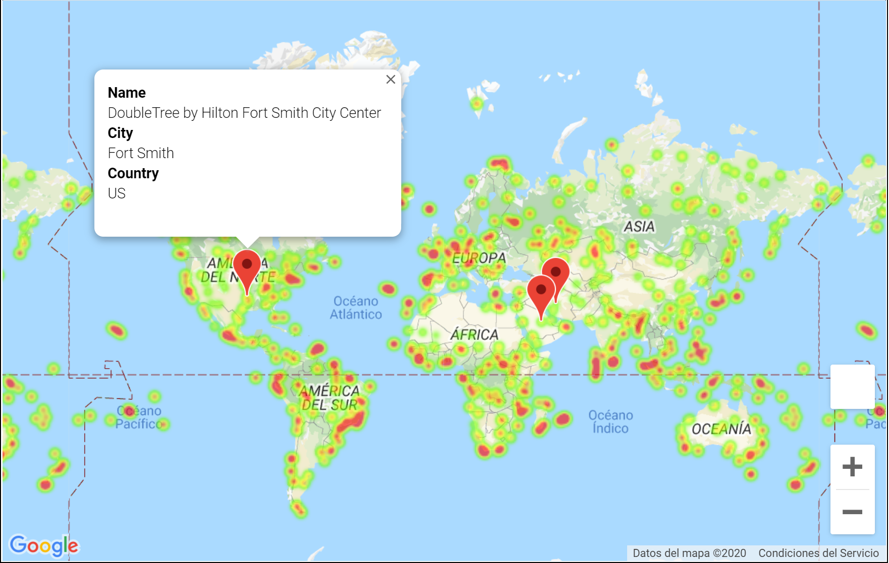

# OpenWeather API Analysis

###### This project has two connected parts:

#### Important Note:This program works from a random list of cities distributed accross the northern and southern hemispheres.Every time you run this program, you will find different results in terms of locations.

#### Part 1

###### Using a Python script to visualize the weather of 500+ cities across the world of varying distance from the equator. OpenWeatherMap API was used to accomplish this part.
###### A series of scatter plots and linear regression models were generated to analyze and find trends through the data:

###### * Temperature (F) vs. Latitude
###### * Humidity (%) vs. Latitude
###### * Cloudiness (%) vs. Latitude
###### * Wind Speed (mph) vs. Latitude

###### The following conclusions summarizes the first part of the analysis:

###### 1. The main question of this analysis was : "What's the weather like as we approach the equator?", and although this is obvious", it was proved throught this data analysis that the answer is : "It gets hotter"; and this can be observed and justified looking at Fig 1, Fig 5 and Fig 6, where temperature increase from negative latitudes to 0 latitude (equator); and aversely decrease as it move from the equator to the north, or positive latitudes.
###### 2. In addition to check temperature's behaviour with respect the Latitud, other variables such as Humidity, Cloudiness and Wind Speed were also analyzed, but none of them has a clear correlation versus Latitude. As it is observed from Figures 7 to 12, and even separating northen and southern hemispheres, these variables doesn't show a comprenhensive relationship with the latitude; and this can be explained because these variables are not "Directly" dependent on Latitude, but on other meteorology variables such as the same temperature and water vapor for the Humidity and Cloudiness case, and altitude and sea level for the Wind Speed case. Saying this, I'm not confirming that these three variable only depends on the previous mentioned factors, but thinking in making an extra analysis, it can help in determining better insights and trends, which helps to create better predictive models.
###### 3. Linear regressions are a good alternative to make predictions, but you must be careful of how good is the model. For this Weather Study, different regression models were generated for each one of the analyzed variables (temperature, humidity,cloudiness and wind speed) with respect Latitude.According to this, only Temperature has an acceptable model, but it's not the best if we want to use it to make predictions, taking in count that the r-squared factor is not very close to 1, which means that the variability of the temperature is not in at least a 90% explained by the Latitude.
###### 4. Even though the main question of this analysis was answered and justified. It's a very good idea to include additional charts to analyze other trends, such as Humidity vs Water Vapor, Wind Speed and Sea Level, Wind Speed and altitude, Cloudiness and precipitations, etc. This can give a better insight of how variables are correlated and what are the main patterns for each variable.

#### Part 2

###### Leveraging the data gathered from Part 1, the goal of Part 2 is to find the best place for future vacations based on some custom weather conditions.
###### Google Places API was used to find the first hotel for each city located within 5000 meters from coordinates.
###### At the end, a Heat Map was generated to visualize the Humidity(%) per city and the location of each hotel encountered:

